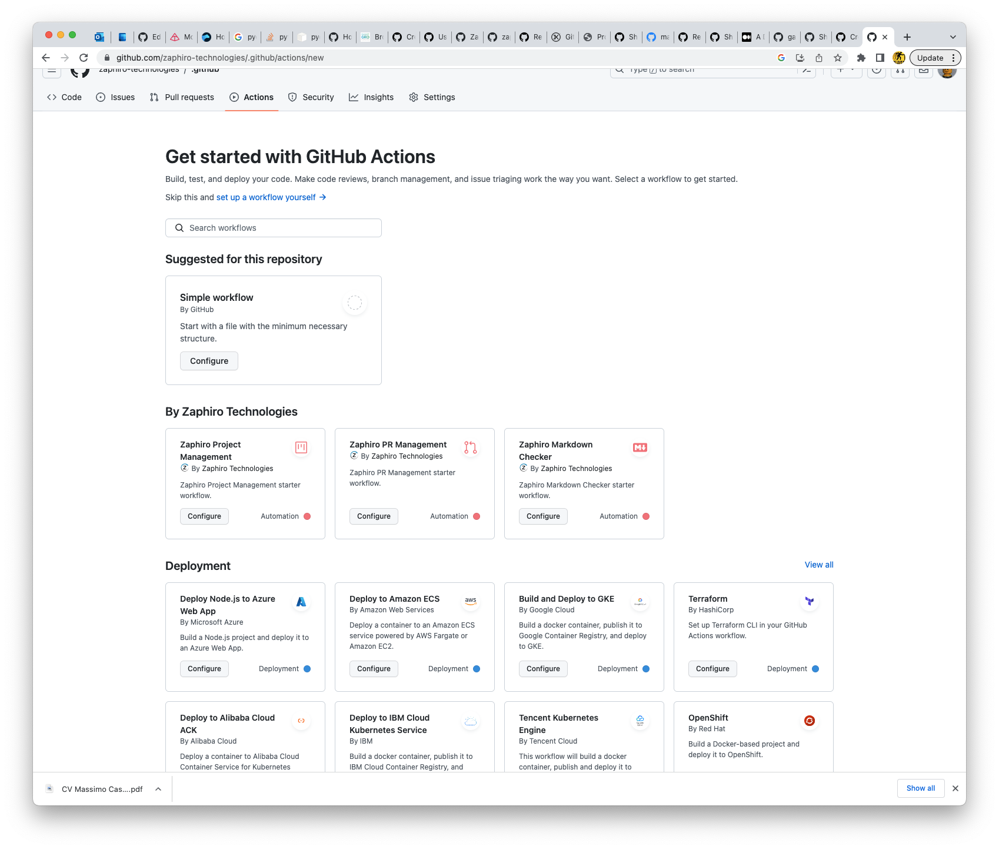

# Reusable GitHub Workflows

This repository hosts [Reusable GitHub Workflows][re-usable-github-workflows].

The repository includes:

- [`add-to-project`](.github/workflows/add-to-project.yaml) workflow: when a new
  issue or PR is added to a repository, it is also added - by default - to the
  [SynchroGuard platform project](https://github.com/orgs/zaphiro-technologies/projects/2)
  or to the project defined by `project-url` input parameter with status `new`.
  When a new PR is added, the PR is assigned to its creator. When a PR is set to
  ready, reviewers from `reviewers-team` input parameter (default value
  `backend-devs`) or `reviewers-individuals` (comma separated) are added.
- [`check-pr`](.github/workflows/check-pr.yaml) workflow: when a new PR is added
  to a repository or any change occurs to the PR, the PR is validated to be sure
  that labels are valid.
- [`clean-up-storage`](.github/workflows/clean-up-storage.yaml) workflow: when a
  new PR is closed, related cache and artifact are deleted.
- [`markdown`](.github/workflows/markdown.yaml) workflow: lint all Markdown
  documents and checks that the links referenced in the documents are valid. If
  `skip-spell-check: false`, also, a spell checker is executed.
- [`release-notes`](.github/workflows/release-notes.yaml) workflow:
  automatically updates release notes using PR titles and labels.
- [`golang`](.github/workflows/golang.yaml) workflow: lint, test and benchmark
  Go Applications. The workflow includes authentication to GitHub Container
  Registry in case tests rely on private images. To retrieve the images, you
  need also to set
  [`read permission`](https://docs.github.com/en/packages/learn-github-packages/configuring-a-packages-access-control-and-visibility#ensuring-workflow-access-to-your-package)
  for the repository on the package.
- [`docker`](.github/workflows/docker.yaml) workflow: build and push Docker
  images
- [`clean-up-docker`](.github/workflows/clean-up-docker.yaml) workflow: when a
  PR is closed, related docker images and untagged ones are deleted
- [`license`](.github/workflows/license.yaml) workflow: add licensing
  information in file headers and check dependencies licensing compatibility.

Some of these workflows are configured as [starter workflows][starter-workflows]
in the [`.github`][.github] repository, so that you can add them at any time
from the actions page.



## How to add a shared workflow to this repository

1. The new workflow need to be callable, i.e., include:

   ```yaml
   on:
     workflow_call:
   ```

   This type of trigger can also be used to specify input parameters, as
   discussed in [Reusable GitHub Workflows][re-usable-github-workflows]
   documentation. In which case we recommend to also include default values.

1. Ideally, the workflow should be tested in this repository itself before being
   used in other repositories. In relation to this, it is then important that
   you trigger it with events such as `issues` or `pull_request` and that, for
   these events, that do not support input parameters, you find a way to pass
   default values. See [markdown](.github/workflows/markdown.yaml) workflow for
   one of the possible way to solve the issue.

1. Once the new workflow is available in the main branch, you can call it using
   something like:

   ```yaml
   jobs:
     add-to-project:
       uses: zaphiro-technologies/github-workflows/.github/workflows/add-to-project.yaml@main
       secrets: inherit
   ```

   Of course, you can also test it from a branch, in which case you can replace
   `main` with the branch name.

## How to add a starter workflow to `.github` repository

Should you wish to advertise the re-usable workflow to your organization
developers in the `new action` page:

1. You need to create a template in the [`.github` repository][.github] in the
   folder
   [`workflow-templates`](https://github.com/zaphiro-technologies/.github/tree/main/workflow-templates):

   ```yaml
   name: Project Management
   on:
     issues:
       types:
         - labeled
     pull_request:
       branches: [$default-branch]
       types:
         - labeled
     workflow_call:

   jobs:
     add-to-project:
       uses: zaphiro-technologies/github-workflows/.github/workflows/add-to-project.yaml@main
       secrets: inherit
   ```

1. You need to create a linked `.properties.json` file including the related
   metadata:

   ```yaml
   {
     "name": "Zaphiro Project Management",
     "description": "Zaphiro Project Management starter workflow.",
     "iconName": "octicon project",
     "categories": ["Automation", "utilities"],
   }
   ```

   For icons, we leverage [octicon icons][octicon].

You can find more information in [starter workflows][starter-workflows]
documentation.

## Grammar check support

To support it in your repo, you need to download and install the grammar check
[script](grammar-check.sh) in your repository. You can customise parameters or
just use what's in the script. In the GitHub action mode (the default mode), the
script uses the set of parameters included in [`.gramma.json`](.gramma.json).

You can include files that you want to be ignored in the
[`.grammarignore`](.grammarignore) file.

To use the local mode, that uses additional rules, run:

```bash
./grammar-check.sh -m local
```

To check a single file using the interactive mode, run:

```bash
./grammar-check.sh -m local -f filename.md
```

To check a list of file using the interactive mode, run:

```bash
./grammar-check.sh -f "filename1.md filename2.md"
```

## References

- [Reusable GitHub Workflows][re-usable-github-workflows]
- [octicon icons][octicon]
- [`.github` repository][.github]
- [Starter workflows][starter-workflows]

[re-usable-github-workflows]:
  https://docs.github.com/en/actions/using-workflows/reusing-workflows
[octicon]: https://primer.style/design/foundations/icons/
[.github]: https://github.com/zaphiro-technologies/.github
[starter-workflows]:
  https://docs.github.com/en/actions/using-workflows/creating-starter-workflows-for-your-organization
