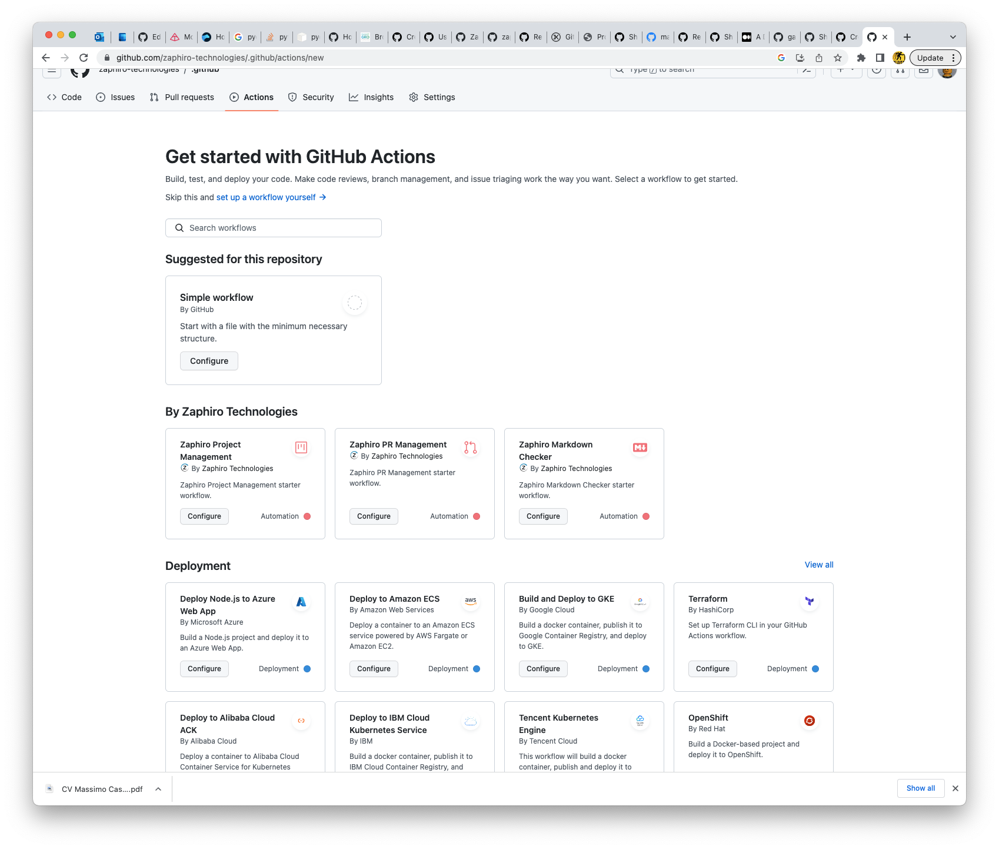

# Reusable GitHub Workflows

This repository hosts [Reusable GitHub Workflows][re-usable-github-workflows].

The repository includes:

- [`add-to-project`](.github/workflows/add-to-project.yaml): when a new issue or
  PR is added to a repository, it is also added - by default - to the
  [SynchroGuard platform project](https://github.com/orgs/zaphiro-technologies/projects/2)
  or to the project defined by `project-url` input parameter with status `new`.
  When a new PR is added, the PR is assigned to its creator. When a PR is set to
  ready, reviewers from `reviewers-team` input parameter (default value
  `backend-devs`) or `reviewers-individuals` (comma separated) are added.
- [`approve-and-merge`](.github/workflows/approve-and-merge.yaml): periodically
  check for dependabot PRs, if their checks pass, approve and merge the PR.
- [`manage-issues`](.github/workflows/manage-issues.yaml) workflow: automated
  issue and PR management including stale issue detection and priority
  synchronization. The workflow includes two main jobs:
  - **Stale Issue Management**: Identifies issues older than `stale-days`
    (default: 60) without a current or future iteration and marks them as stale.
    Automatically removes the stale label if an issue is added to an iteration.
    Closes stale issues as "not planned" after `close-after-days` (default: 7)
    without updates or being added to an iteration. Supports `skip-label`
    (default: "keep") to exclude specific issues from stale processing - issues
    with this label are never marked stale or closed. Supports `dry-run` mode
    (default: false) for testing changes without applying them.
  - **Priority Synchronization**: Syncs priority values from GitHub Projects to
    issue labels (P0-P3) for security-labeled issues. Runs daily at midnight via
    schedule, can be triggered manually via workflow_dispatch with custom
    parameters, or called by other workflows.
- [`check-pr`](.github/workflows/check-pr.yaml) workflow: when a new PR is added
  to a repository or any change occurs to the PR, the PR is validated to be sure
  that labels are valid.
- [`clean-up-docker`](.github/workflows/clean-up-docker.yaml): when a PR is
  closed, related docker images and untagged ones are deleted
- [`clean-up-storage`](.github/workflows/clean-up-storage.yaml): when a new PR
  is closed, related cache and artifact are deleted.
- [`deployment`](.github/workflows/deployment.yaml): commit a container image
  tag in the k8s-deployments repository, or patch a corporate app manifest in
  the corporate-apps repository when called with `environment: corporate`.
  Corporate mode updates `argocd/<app-name>.yaml` at
  `<parameter-prefix>.image.tag`. Use optional `ghcr-repository` to override the
  package repository used to resolve the image digest. Corporate deployments
  must provide `ghcr-repository`. The workflow resolves the selected image tag
  directly from GHCR and commits the resulting OCI digest.
- [`dependabot-vex`](.github/workflows/dependabot-vex.yaml): generate reviewed
  OpenVEX candidates from dismissed Dependabot alerts and create or update a
  pull request. Candidates default to `under_investigation`; callers must
  explicitly opt in before a dismissal reason can produce a `not_affected`
  statement.
- [`docker`](.github/workflows/docker.yaml): build and push Docker images,
  publish BuildKit SBOM/provenance attestations, and scan the pushed image by
  its immutable digest. The workflow exposes the image, digest, image reference,
  target platforms, and machine-readable vulnerability evidence as outputs or
  artifacts. For multi-stage images, Dockerfiles must explicitly declare
  `BUILDKIT_SBOM_SCAN_STAGE` when build-stage dependencies are part of the
  application evidence. Supports optional Docker Hub login for builds that need
  authenticated base image pulls; callers can pass `DOCKER_USER` and
  `DOCKER_PASSWORD` secrets, which must be provided together. For private GitHub
  git dependencies during `docker build`, pass the additional private
  repositories via the `repositories` input so the generated GitHub App token
  can access them, then consume the forwarded BuildKit secret (`GH_TOKEN`) in
  the Dockerfile. The Docker build image must also include the `git` binary.
  When `.vex/dependabot.openvex.json` exists, the workflow attaches it as an
  unsigned OCI referrer and scans the same immutable image reference with OCI
  VEX discovery. Image signing is intentionally deferred to a separate change.
  Callers need `packages: write`.
- [`golang`](.github/workflows/golang.yaml): lint, test and benchmark Go
  Applications. The workflow includes authentication to GitHub Container
  Registry in case tests rely on private images. The workflow also scans for
  vulnerabilities.
- [`js`](.github/workflows/js.yaml): typecheck, lint, test and build JS/TS
  applications. The workflow can auto-fix lint issues on same-repository pull
  requests, optionally pull DVC datasets, upload the build artifact and a
  machine-readable dependency SBOM, and scan for code quality and
  vulnerabilities. The dependency SBOM describes the packages used to create
  a bundled frontend; it is distinct from the runtime image SBOM.
- [`license`](.github/workflows/license.yaml): add licensing information in file
  headers and check dependencies licensing compatibility.
- [`lint`](.github/workflows/markdown.yaml): lint all Markdown and Yaml files.
  In case of markdown documents, checks that the links referenced in the
  documents are valid. If `skip-spell-check: false`, also, a spell checker is
  executed.
- [`new-release`](.github/workflows/new-release.yaml): opt-in release owner
  that updates the version, creates the release tag, generates application
  dependency evidence, assembles a draft release, and publishes it after
  the tag-triggered Docker workflow succeeds. The tag triggers each repository's
  Docker workflow, which builds the image using the tag. It deliberately exposes
  no Docker configuration; Docker defaults and repository-specific settings
  belong to `docker`.
- [`python`](.github/workflows/python.yaml): lint, test python applications. The
  workflow includes authentication to GitHub Container Registry in case tests
  rely on private images. The workflow also scans for vulnerabilities.
- [`release-notes`](.github/workflows/release-notes.yaml): automatically updates
  release notes using PR titles and labels, including when a release or draft
  release is created. It does not create GitHub Releases or publish SBOM
  evidence; those responsibilities belong to `new-release`.
- [`trivy-cache-update`](.github/workflows/trivy-cache-update.yaml): update
  trivy cache image.

Some of these workflows are configured as [starter workflows][starter-workflows]
in the [`.github`][.github] repository, so that you can add them at any time
from the actions page.



## How to add a shared workflow to this repository

1. The new workflow need to be callable, i.e., include:

   ```yaml
   on:
     workflow_call:
   ```

   This type of trigger can also be used to specify input parameters, as
   discussed in [Reusable GitHub Workflows][re-usable-github-workflows]
   documentation. In which case we recommend to also include default values.

1. Ideally, the workflow should be tested in this repository itself before being
   used in other repositories. In relation to this, it is then important that
   you trigger it with events such as `issues` or `pull_request` and that, for
   these events, that do not support input parameters, you find a way to pass
   default values. See [markdown](.github/workflows/markdown.yaml) workflow for
   one of the possible way to solve the issue.

1. Once the new workflow is available in the main branch, you can call it using
   something like:

   ```yaml
   jobs:
     add-to-project:
       uses: zaphiro-technologies/github-workflows/.github/workflows/add-to-project.yaml@<immutable-version>
       secrets: inherit
   ```

   Production callers should use an immutable release tag or commit SHA. You can
   also test it from a branch, in which case you can replace the version with the
   branch name.

## Managed immutable releases

Repositories adopting [`new-release`](.github/workflows/new-release.yaml)
should add a small `workflow_dispatch` wrapper that calls the reusable workflow.
Repositories that do not adopt the workflow can continue using `release-notes`
for notes, but need to migrate to `new-release` to publish a managed release.
The selected workflow branch is the release source; only `main` and
`release/**` are accepted, so patch releases can be created from an older
release branch without allowing feature-branch releases.

```yaml
name: Release
on:
  workflow_dispatch:

jobs:
  release:
    uses: zaphiro-technologies/github-workflows/.github/workflows/new-release.yaml@<immutable-version>
    secrets: inherit
```

## Dependabot VEX candidates

Repositories can schedule [`dependabot-vex`](.github/workflows/dependabot-vex.yaml)
to create or update a pull request containing OpenVEX candidates for currently
dismissed Dependabot alerts. The caller may provide explicit product PURLs or
let the workflow derive the default GHCR product PURL. The caller must grant
the called workflow `contents`, `pull-requests`, and `vulnerability-alerts`
permissions:

```yaml
name: Dependabot VEX
on:
  schedule:
    - cron: "30 3 * * *"
  workflow_dispatch:

jobs:
  vex:
    permissions:
      contents: write
      pull-requests: write
      vulnerability-alerts: read
    uses: zaphiro-technologies/github-workflows/.github/workflows/dependabot-vex.yaml@<immutable-version>
    with:
      # Optional: defaults to the repository's GHCR image.
      image-name: example
```

When `product-purls` is omitted, the workflow derives the default GHCR product
PURL from `github.repository_owner` and `image-name` (or the repository name):
`pkg:oci/<image-name>?repository_url=ghcr.io/<owner>/<image-name>`. Supply
explicit `product-purls` when the repository publishes multiple images, uses a
different registry, or needs digest-specific scope.

Generated statements use `under_investigation` by default. Reviewers must
confirm the product scope, vulnerable component, and reachability before
changing a statement to `not_affected`. The workflow also maintains
`.vex/dependabot-dismissals.json`; this repository-owned ledger preserves the
original dismissal reason and comment after GitHub later changes an alert to
`fixed`.

If a historical dismissal predates the workflow, add it to the ledger once and
let the workflow generate the corresponding candidate. For example, the
documentation repository can preserve alert 28 with:

```json
{
  "version": 1,
  "alerts": [
    {
      "alert": 28,
      "url": "https://github.com/zaphiro-technologies/documentation/security/dependabot/28",
      "package": {
        "ecosystem": "npm",
        "name": "serialize-javascript"
      },
      "vulnerability": {
        "name": "GHSA-5c6j-r48x-rmvq"
      },
      "dismissed_reason": "not_used",
      "dismissed_comment": "No dynamic regex evaluation is used by the up, so we will wait docusaurus to update the dependency",
      "dismissed_by": "chicco785",
      "last_observed_state": "dismissed"
    }
  ]
}
```

To map this reason to OpenVEX `not_affected`, the caller may set
`auto-not-affected-reason: not_used`. This is an explicit opt-in: reviewers
still need to verify that the product PURLs and vulnerable component scope are
correct. The ledger entry should not be reused for products or image digests
that do not contain the vulnerable component.

## How to add a starter workflow to `.github` repository

Should you wish to advertise the re-usable workflow to your organization
developers in the `new action` page:

1. You need to create a template in the [`.github` repository][.github] in the
   folder
   [`workflow-templates`](https://github.com/zaphiro-technologies/.github/tree/main/workflow-templates):

   ```yaml
   name: Project Management
   on:
     issues:
       types:
         - labeled
     pull_request:
       branches: [$default-branch]
       types:
         - labeled
     workflow_call:

   jobs:
     add-to-project:
       uses: zaphiro-technologies/github-workflows/.github/workflows/add-to-project.yaml@<immutable-version>
       secrets: inherit
   ```

1. You need to create a linked `.properties.json` file including the related
   metadata:

   ```yaml
   {
     "name": "Zaphiro Project Management",
     "description": "Zaphiro Project Management starter workflow.",
     "iconName": "octicon project",
     "categories": ["Automation", "utilities"],
   }
   ```

   For icons, we leverage [octicon icons][octicon].

You can find more information in [starter workflows][starter-workflows]
documentation.

## References

- [Reusable GitHub Workflows][re-usable-github-workflows]
- [octicon icons][octicon]
- [`.github` repository][.github]
- [Starter workflows][starter-workflows]

[re-usable-github-workflows]:
  https://docs.github.com/en/actions/using-workflows/reusing-workflows
[octicon]: https://primer.style/design/foundations/icons/
[.github]: https://github.com/zaphiro-technologies/.github
[starter-workflows]:
  https://docs.github.com/en/actions/using-workflows/creating-starter-workflows-for-your-organization

## Issues

Linkspector 1.5.x is broken, so force manual install of Chrome for Puppeteer.
